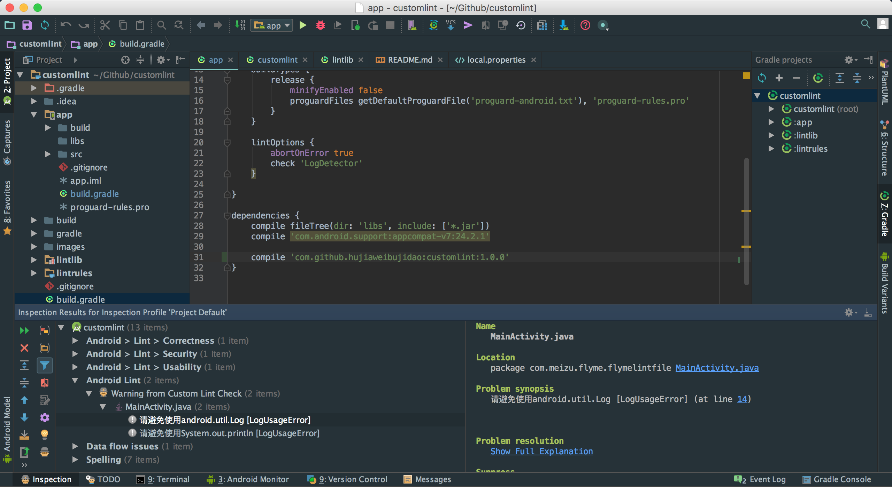

This project shows how to custom lint rules and use these rules to analyze Android project.

If you are not familiar with Lint, please read [this document](http://hujiaweibujidao.github.io/blog/2016/11/09/Head-First-Customizing-Lint) before you dive into the source code of this project.

